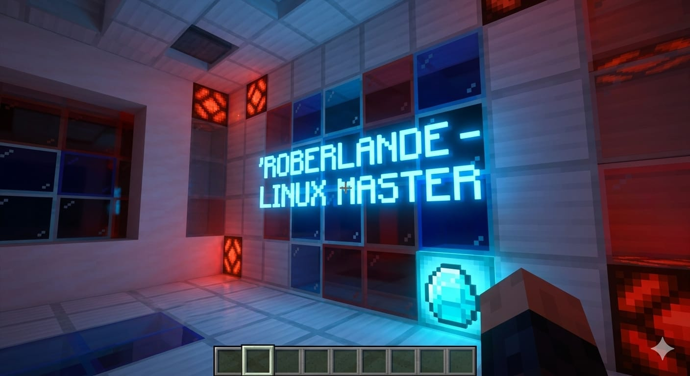

# Linux Automation Toolbox 🛠️

Repositório profissional de scripts para automação de manutenção, áudio e **monitoramento de recursos** no Linux.

## 🚀 Ferramentas Incluídas:

* **monitor_sistema.sh:** Painel em tempo real de CPU, RAM e Disco.
* **system_maintenance.sh:** Automatiza o update e limpeza profunda do sistema.
* **linux_audio_repair.sh:** Restaura configurações de áudio e microfone instantaneamente.

## 👷 Autor:
**Roberlande Silva**
*Analista focado em Automação e Performance de Sistemas.*
